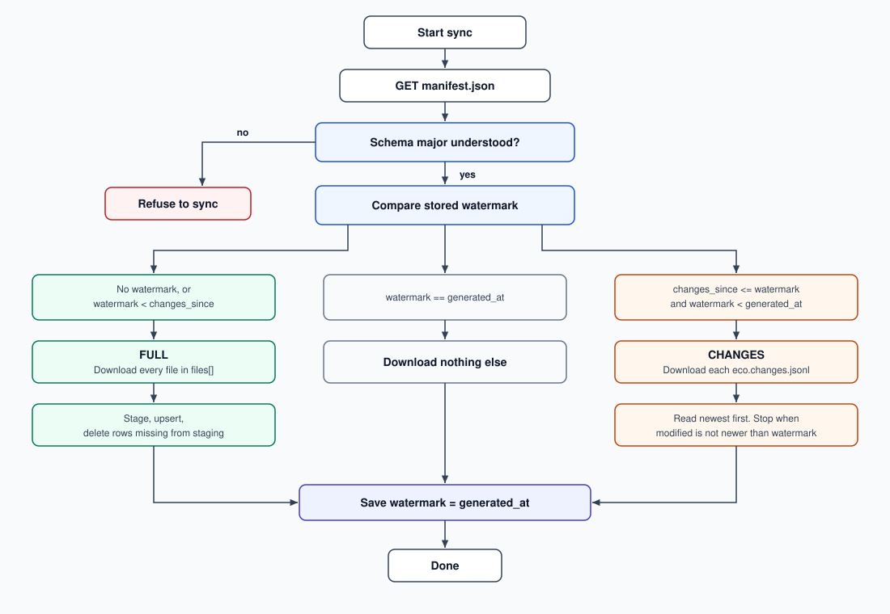

# malicious-packages

Processes [OSSF malicious-packages](https://github.com/ossf/malicious-packages) into lightweight,
incrementally consumable JSONL files per ecosystem for fast consumption by DepGate/OSSShield and similar tools.

## Output

Everything lives in `malicious-packages/` and is committed to this repository, so it can be fetched with
`git clone --depth 1` or over raw GitHub HTTP
(`https://github.com/depgate/malicious-packages/raw/refs/heads/main/malicious-packages/<file>`).

| File | Purpose |
|------|---------|
| `manifest.json` | Feed metadata: schema version, run timestamp, upstream commit, list of snapshot files per ecosystem with hashes and counts |
| `<ecosystem>.jsonl` or `<ecosystem>-NN.jsonl` | Full snapshot: one record per malicious package, sorted by `name`. Split into numbered shards when it exceeds `shard_max_bytes` |
| `<ecosystem>.changes.jsonl` | Rolling window (default 180 days) of upsert/delete operations, newest first |

Ecosystems: `npm`, `pypi`, `go`, `maven`, `nuget`, `crates.io`, `rubygems`, `vscode`,
`vscode-open-vsx.org` (the upstream ecosystem `vscode:open-vsx.org`; `:` is replaced by `-` in file names).

### Sharding and GitHub size limits

GitHub warns on files above 50 MB and rejects pushes above 100 MB. To stay well clear of that, a
snapshot larger than `shard_max_bytes` (default 25 MB) is written as `<ecosystem>-00.jsonl`,
`<ecosystem>-01.jsonl`, ... Each shard is itself sorted by `name` and holds a contiguous name range,
so reading `files[]` in order yields the complete snapshot sorted by name.
A snapshot that fits in one file is written as plain `<ecosystem>.jsonl`.

Consumers must take file names from `manifest.json` (`ecosystems.<eco>.files[]`), never guess them.
Sharding only affects a FULL load, where "download the snapshot" means "download each file in
`files[]`"; the weekly CHANGES path is unaffected because changes files are never sharded (they are
small by design). `npm run validate` fails if any file approaches the GitHub limit.

### Snapshot record (`<ecosystem>.jsonl`)

```json
{"name":"embiggen","id":"MAL-2026-5314","aliases":["GHSA-xxxx-xxxx-xxxx"],"versions":["0.11.97"],"published":"2026-06-06T06:13:57Z","modified":"2026-09-27T03:23:00Z"}
```

| Field | Required | Meaning |
|-------|----------|---------|
| `name` | yes | Package name as published in the registry. Unique within a file. |
| `id` | usually | Primary OSV identifier (`MAL-YYYY-N`). When several upstream reports cover the same package, the lowest id is primary and the others are listed in `aliases`. |
| `aliases` | no | Other identifiers for the same finding (`GHSA-*`, `SNYK-*`, additional `MAL-*`). Sorted. |
| `versions` | no | Malicious versions. **Omitted means every version of the package is malicious** (OSV range `introduced: "0"`). Sorted. |
| `published` | no | Earliest upstream `published` timestamp across merged reports. |
| `modified` | yes | Feed-level timestamp of the run in which this record was added or last changed. Use it as the sync watermark. |

All reports for a package are merged into one record. Withdrawn upstream reports are excluded;
a package whose reports are all withdrawn disappears from the snapshot and produces a `delete` op.

### Change operation (`<ecosystem>.changes.jsonl`)

```json
{"op":"upsert","modified":"2026-09-27T03:23:00Z","name":"embiggen","id":"MAL-2026-5314","versions":["0.11.97"],"published":"2026-06-06T06:13:57Z"}
{"op":"delete","modified":"2026-09-20T03:07:00Z","name":"some-false-positive"}
```

- `upsert` carries the full current record (same fields as the snapshot). Replace the stored row entirely.
- `delete` carries only `name`. Remove the row.
- The file contains at most one op per `name` (the newest), sorted by `modified` descending, then `name`.
- Ops older than `changes_window_days` (see manifest) are pruned.

### Manifest (`manifest.json`)

```json
{
  "schema_version": "2.0.0",
  "generated_at": "2026-09-27T03:23:00Z",
  "upstream_repo": "https://github.com/ossf/malicious-packages.git",
  "upstream_commit": "af3e7b18d0e04aedeb9009af50f18a618b3da2d3",
  "changes_since": "2026-03-31T03:23:00Z",
  "changes_window_days": 180,
  "shard_max_bytes": 20971520,
  "total_records": 238675,
  "ecosystems": {
    "npm": {
      "files": [
        {"file": "npm-00.jsonl", "sha256": "...", "bytes": 20971000, "records": 160000},
        {"file": "npm-01.jsonl", "sha256": "...", "bytes": 8050645,  "records": 61826}
      ],
      "records": 221826,
      "bytes": 29021645,
      "changes_file": "npm.changes.jsonl",
      "changes_sha256": "...",
      "changes_bytes": 29659,
      "changes_records": 211,
      "max_modified": "2026-09-27T03:23:00Z"
    },
    "maven": {
      "files": [
        {"file": "maven.jsonl", "sha256": "...", "bytes": 286, "records": 2}
      ],
      "records": 2,
      "bytes": 286,
      "changes_file": "maven.changes.jsonl",
      "changes_sha256": "...",
      "changes_bytes": 0,
      "changes_records": 0,
      "max_modified": "2026-09-27T03:23:00Z"
    }
  }
}
```

Field notes:

- `generated_at`: when this feed version was produced. This is the value clients store as their watermark.
- `changes_since`: the oldest watermark the changes files are complete for. Normally
  `generated_at - changes_window_days`; after a reset (`--fresh`) it equals `generated_at`.
  It never moves backwards.
- `files[]`: always at least one entry; iterate it on a full load.
- `sha256` values are for verifying downloads. They are not needed to decide what to download.
- `schema_version` follows semver: additive fields bump the minor version, breaking changes bump the
  major. Consumers should reject a major version they do not understand.

## Consuming the feed

The client stores **one value**: the watermark, which is the `generated_at` of the last manifest it
applied. Every sync starts with `GET manifest.json` and then makes a single decision:



The snapshot files (`<eco>.jsonl`, or `<eco>-00.jsonl`, `<eco>-01.jsonl`, ...) always contain every
current package. `<eco>.changes.jsonl` contains only packages added, changed, or removed inside the
window. A client that stays within that window never downloads the snapshot again.

| Condition | Action | Download |
|-----------|--------|----------|
| no watermark, or `watermark < changes_since` | **FULL**: for each ecosystem, load every file in `files[]` into a staging table, upsert, delete rows not present in staging | all snapshot files (~30 MB) |
| `watermark == generated_at` | **NOTHING**: the feed has not run since | manifest only (~6 KB) |
| otherwise | **CHANGES**: for each ecosystem, read `<eco>.changes.jsonl` top-down and stop at the first line with `modified <= watermark`; `upsert` -> `INSERT ... ON CONFLICT (name, ecosystem) DO UPDATE`, `delete` -> `DELETE ... WHERE name IN (...)` | changes files (~30 KB) |

When every ecosystem has been applied, set `watermark = generated_at`. If anything fails, leave the
watermark unchanged; the next run redoes the same (idempotent) work.

Why this is enough:

- Every snapshot is complete, so FULL is always correct, whatever state the client is in.
- The changes file is cumulative within its window and the producer guarantees it is complete for any
  watermark `>= changes_since`, so CHANGES is correct for every client that is not too far behind.
  Missed weeks are harmless: the client simply reads further down the file.
- A feed reset moves `changes_since` forward to `generated_at`, so every existing client falls into
  FULL on its next sync without knowing a reset happened.
- Verify each downloaded file against its `sha256` from the manifest.

Typical lifetime of one client:

```
install    -> manifest + npm-00.jsonl + npm-01.jsonl   (FULL)      ~28 MB
week 1     -> manifest + npm.changes.jsonl             (CHANGES)   ~30 KB
week 2     -> manifest only                            (NOTHING)   ~6 KB
week 3     -> manifest + npm.changes.jsonl             (CHANGES, covers weeks 2-3)
9 months   -> manifest + all npm shards                (FULL: watermark < changes_since)
```

### Reference client

`client/index.ts` implements the table above against a local `malicious-packages/` folder. It has no
database; it keeps a state file (`.client-state.json`) holding the watermark and reports, per
ecosystem, the shard count, which files it would download and how many rows it would upsert/delete.

```bash
npm run client                                   # inspect: full records, shards and change ops per ecosystem
npm run client -- --first                        # first-time load (FULL), saves the watermark
npm run client -- --next                         # subsequent sync using the saved watermark, saves it
npm run client -- --next --since 2026-09-27T03:23:00Z   # simulate a client with that watermark
npm run client -- --next --dry-run               # decide and report without saving state
npm run client -- --dir /path/to/malicious-packages --state /tmp/state.json --json
```

## Usage

```bash
npm install
npm run process                     # full run, writes to malicious-packages/ (CI)
npm run process:test                # smoke test: 10 packages per ecosystem -> .tmp-malicious-output/
npm run process -- --limit 20       # custom limit (also writes to .tmp-malicious-output/)
npm run validate                    # verify manifest hashes, shard ordering, counts, size limits
```

Flags: `--out <dir>` output directory, `--repo <dir>` reuse an existing upstream clone instead of
cloning (handy for local iteration), `--window-days <n>` changes window (default 180),
`--shard-max-bytes <n>` snapshot shard size (default 25 MB), `--force` override the mass-delete guard,
`--fresh` reset (see below).

The producer clones the upstream repo with `git clone --depth 1` (no API), merges all OSV reports
per package, and diffs the result against the previously committed snapshot. Records whose content
did not change keep their `modified` timestamp, so rewrites are deterministic and diffs stay small.

Safety guards: the run aborts without writing if the clone yields zero packages, or if any
ecosystem would delete more than 10% of its previous records (protects consumers from a bad
upstream fetch).

### Resetting the feed (`--fresh`)

`npm run process -- --fresh` ignores the previous snapshot, stamps every record with the run
timestamp, writes **empty** changes files and sets `changes_since = generated_at`. Every client then
performs one FULL load on its next sync. Use it after a change to the merge rules or record shape
(bump `schema_version` too if the shape changed); never run it on a schedule. Regular runs never need
a reset: the changes files are bounded by the window and by one op per package, so they stay small.

A run that finds no `manifest.json` in the output directory (first run, or the folder was emptied)
automatically behaves as `--fresh`, since there is no previous state to diff against.

## Pipeline

A GitHub Action (`.github/workflows/process-daily.yml`) runs weekly (Sunday 00:00 UTC) and on
manual dispatch. It runs the producer, validates the output, and commits `malicious-packages/` if anything
changed. Upstream OSSF data is updated daily, so the schedule can be tightened without code changes.

When the feed changes, the same workflow publishes a release whose asset is `malicious-packages.tar.gz`
(the `malicious-packages/` directory). The newest one is always available at:

```
https://github.com/depgate/malicious-packages/releases/latest/download/malicious-packages.tar.gz
```

Feed releases older than 14 days are deleted. The newest release is kept even if it is older than
that, so the URL above keeps resolving. The archive is a bulk snapshot for a first load or an
offline copy. Incremental clients should keep using `manifest.json` and the changes files.
